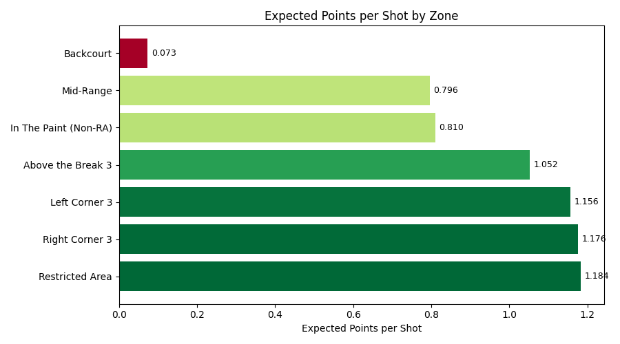
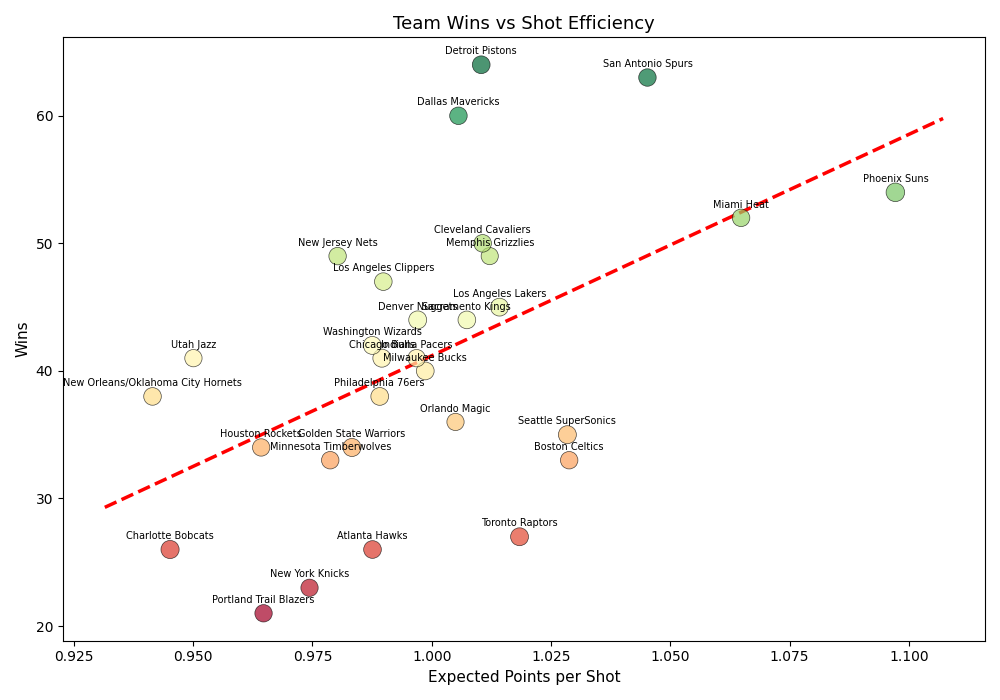
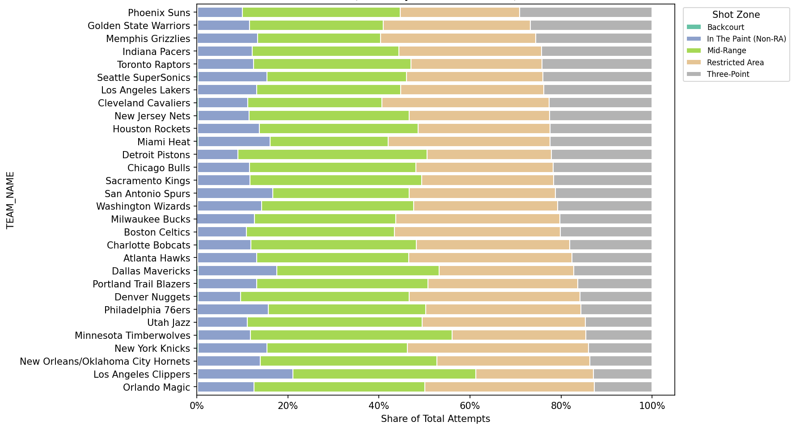

```{r setup, include=FALSE}
knitr::opts_chunk$set(echo = TRUE)
```

```{python include=FALSE}

# ----  Dependencies ---- 
import sys
import os
import warnings
import numpy as np
import pandas as pd
import matplotlib
matplotlib.use("Agg")
import matplotlib.pyplot as plt
import matplotlib.ticker as mticker
from matplotlib.lines import Line2D
import statsmodels.api as sm
import scipy as stats


# ---- Parameters ----
OUTPUT_DIR = "./analysis"


os.makedirs(OUTPUT_DIR, exist_ok=True)


# ---- Ingest System ----
csv_file = "nbaShots05_06.csv"
shots_data = pd.read_csv(csv_file)
# ---- Manual Record Dataframe ----
# created df for team records
# got lazy - didn't want to specify filepaths and since csv reader could only handle one...
records = pd.DataFrame({
    "TEAM_NAME": [
        "Detroit Pistons",
        "San Antonio Spurs",
        "Dallas Mavericks",
        "Phoenix Suns",
        "Miami Heat",
        "Cleveland Cavaliers",
        "Memphis Grizzlies",
        "New Jersey Nets",
        "Los Angeles Clippers",
        "Los Angeles Lakers",
        "Denver Nuggets",
        "Sacramento Kings",
        "Washington Wizards",
        "Chicago Bulls",
        "Indiana Pacers",
        "Utah Jazz",
        "Milwaukee Bucks",
        "New Orleans/Oklahoma City Hornets",
        "Philadelphia 76ers",
        "Orlando Magic",
        "Seattle SuperSonics",
        "Golden State Warriors",
        "Houston Rockets",
        "Boston Celtics",
        "Minnesota Timberwolves",
        "Toronto Raptors",
        "Atlanta Hawks",
        "Charlotte Bobcats",
        "New York Knicks",
        "Portland Trail Blazers",
    ],
    "Wins": [64, 63, 60, 54, 52, 50, 49, 49, 47, 45, 44, 44, 42, 41, 41,
             41, 40, 38, 38, 36, 35, 34, 34, 33, 33, 27, 26, 26, 23, 21],
    "Losses": [18, 19, 22, 28, 30, 32, 33, 33, 35, 37, 38, 38, 40, 41, 41,
               41, 42, 44, 44, 46, 47, 48, 48, 49, 49, 55, 56, 56, 59, 61],
})


# ---- Data Cleaning ----
#converting to types
# date, y-m-d, numeric 
#adding shot point values

shots_data["GAME_DATE"] = pd.to_datetime(shots_data["GAME_DATE"], format="%Y%m%d")

for col in ["SHOT_MADE_FLAG", "SHOT_ATTEMPTED_FLAG", "SHOT_DISTANCE", "LOC_X", "LOC_Y", "PERIOD", "MINUTES_REMAINING", "SECONDS_REMAINING"]:
    if col in shots_data.columns:
        shots_data[col] = pd.to_numeric(shots_data[col])

shots_data["POINT_VALUE"] = shots_data["SHOT_TYPE"].apply(
    lambda x: 3 if "3pt" in str(x).lower() else 2 # ID if 
)

```

## Column Types

The data set of nbaShots05_06.csv is actively tracking each shot attempt throughout the regular season by players in an instance form. There are several things captured in the dataset, notated by the column names.

```{r}

library(readxl)
library(kableExtra)
options(max.print = 500)

df <- data.frame(read_excel("C:/Users/Rober/Desktop/Python Projects/NBA Shot Analysis QMB 3311/analysis/nba_shot_col_mapping.xlsx",col_names = c('Column Name','Column Description')))


kable(df)
```

## Summary Statistics

Using the summary statistics, I decided to view the death of the mid-range shot from when it still had value in 2005-2006. To process this in summary statistics, I specifically used the mean. I ran this chunk in python to extract an expected points value from each 'SHOT_ZONE_BASIC'.

```{python echo=TRUE}

# ---- Summary Statistics, Ex Point p shot ----

zone_eps = (
    shots_data.groupby("SHOT_ZONE_BASIC")
    .agg(
        attempts=("SHOT_ATTEMPTED_FLAG", "sum"),
        makes=("SHOT_MADE_FLAG", "sum"),
        avg_point_value=("POINT_VALUE", "mean"),
    )
    .reset_index()
)

zone_eps["fg_pct"] = zone_eps["makes"] / zone_eps["attempts"]
zone_eps["eps"] = zone_eps["fg_pct"] * zone_eps["avg_point_value"]
zone_eps = zone_eps.sort_values("eps", ascending=False)

print(zone_eps.to_string(index=False, float_format="%.3f"),'\n') # summary of the EPS calculated

```

This is visualized here:



The mid range 2 point shot is classified as the Mid Range and the In The Paint (Non-RA). Evidently, they provide much less expected return, likely due to closer defenders, bunched formations, and more complex shot angles. In contrast, the higher likllihood of the near the rim dunks and layups significantly increased its value in comparison. While still only a 60% clip, the near rim shot is the vastly superior 2 pointer.

Even in 2005, the lower rate at which 3 pointers were made did not devalue the 3 point range below a 2 point shot. The data clearly shows the earned value and benefit of taking the longer range shots less of the time. However, there is a discrepancy to this hypothesis that is explored in the Regression Statistics.

## Regression Analysis

In the regression analysis, I attempted to identify a link between a team's aggregate expected points (from their shot types and shooting percentages) with their season ending win totals. This was done via the following code chunk:

```{python}

# ---- Regressing, predicted wins from aggregated team eps ----

team_season_eps = (
    shots_data.groupby("TEAM_NAME")
    .agg(
        attempts=("SHOT_ATTEMPTED_FLAG", "sum"),
        makes=("SHOT_MADE_FLAG", "sum"),
        avg_point_value=("POINT_VALUE", "mean"),
        avg_distance=("SHOT_DISTANCE", "mean"),
    )
    .reset_index()
)
# team specific aggregated eps via fg%*avg point value of shots
team_season_eps["fg_pct"] = team_season_eps["makes"] / team_season_eps["attempts"]
team_season_eps["eps"] = team_season_eps["fg_pct"] * team_season_eps["avg_point_value"]


```

This was then linked to their season record:

```{python}

regression_df = team_season_eps.merge(records, on="TEAM_NAME", how="inner")

print(
    regression_df[["TEAM_NAME", "Wins", "Losses", "fg_pct", "eps", "attempts", "avg_distance"]]
    .sort_values("Wins", ascending=False)
    .to_string(index=False, float_format="%.3f")
)
```

The regression model yielded some interesting results as it did not directly match the hypothesis. Instead it opened further questions. There was a correlation between the wins and shot efficiency; however some teams that used a mid of the table shot efficiency had the most regular season wins: The Pistons, Mavericks, and the Spurs. The Phoenix Suns used a high rate of three point shots to generate their EPS and the Miami Heat used a mix of play around the hoop and threes to keep the second highest value. As shown in Figure 2.



## External Factors

There are several external factors not considered in this single data file. These include statistics such as rebounds, free throw percentages, or even the number of free throws per team. The last one is significant because two point attempts are much more likely to result in a free throw than a three pointer. The increase of the expected points value of the 2 point shots are not included here. I would need the foul event data and be able to connect between the shot event and the foul event to make the connection. I did make a visual showing each team's shot type rates, and it showed higher 2 point attempt rates for some of the outperforming teams, lending some credence to the free throw hypothesis. As shown in Figure 3.



## Other Notes

While there is not a significant correlation between the EPS taken by each team and the regular season wins, the methodology is somewhat comforted by the Miami Heat winning the NBA finals this season with the second highest EPS value.
